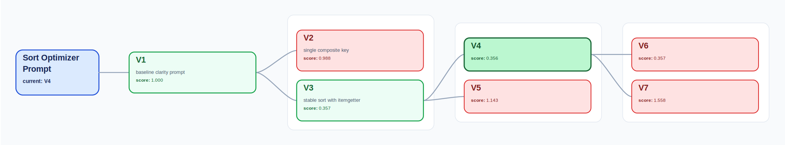
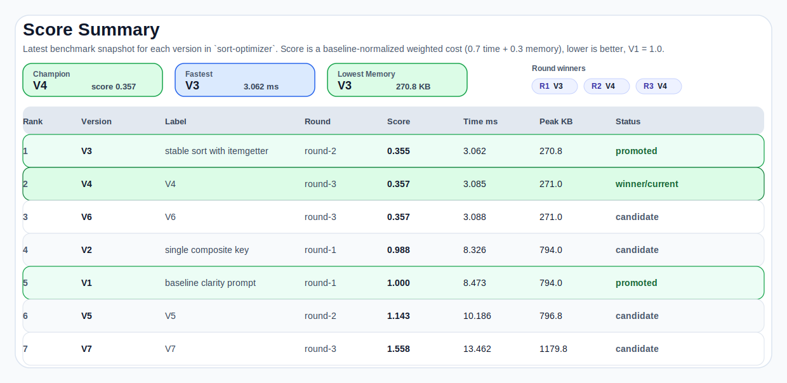
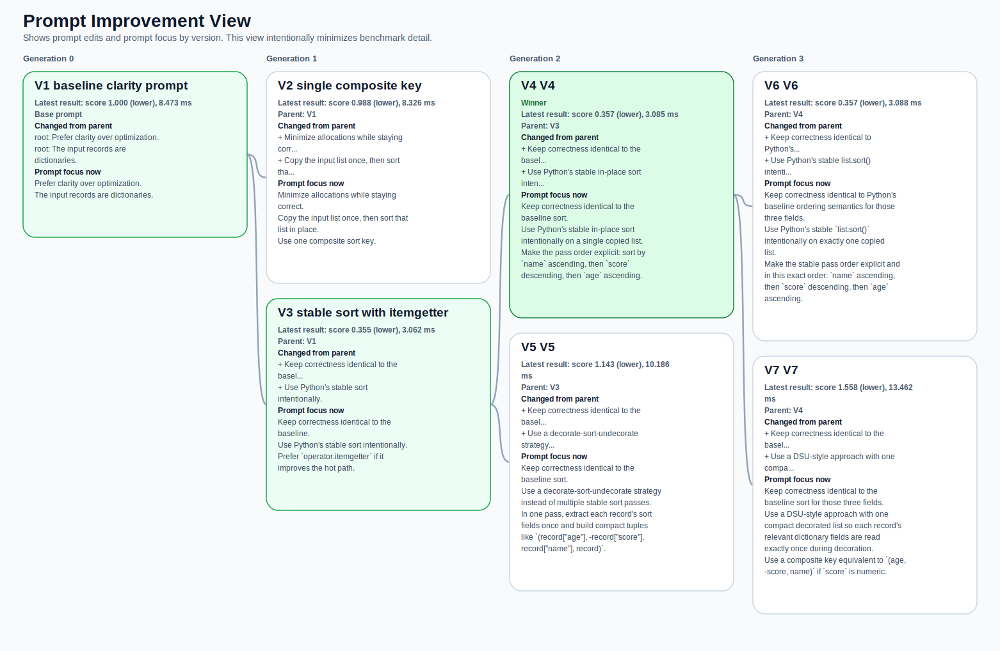

# PromptTree

PromptTree は、テキスト、コード、画像などの生成タスクにまたがって、プロンプトファミリー、出力アーティファクト、外部評価、自動プロモーションを管理するための Python ライブラリです。

English README: [README.md](/Users/hikaru/Desktop/prompttree/README.md)

リポジトリ内で作業するエージェント向けの運用ルールは [AGENTS.md](/Users/hikaru/Desktop/prompttree/AGENTS.md) にあります。変更後に関連する検証を実行し、通るまで修正を継続することが明記されています。

複数のリポジトリで再利用できるように設計されており、主に次の要素を提供します。

- プロンプトファミリーとバージョンのレジストリ
- 生テキストだけでなくアーティファクトハンドルとして保持される出力
- `current`、`best`、派生の `latest` といった名前付き ref
- ブランチ分岐と A/B 実験
- 決定論的な割り当て
- 実行、出力アーティファクト、評価、割り当て、プロンプト ref 改訂、アーティファクト改訂を記録する SQLite ledger
- `best` / `current` の自動更新を行うプロモーションポリシー
- デフォルトの lookback が 3 の repair context
- 各リポジトリが独自のアーティファクトや評価ロジックを定義できる adapter インターフェース

## インストール

```bash
pip install -e .
```

インストール後は、利用するプロジェクトで初期化します。

```bash
prompttree init --root .
```

これにより、現在のプロジェクト配下に `prompting/` と `.prompttree/prompttree.db` が作られます。パッケージをインストールしただけでは、これらのディレクトリや DB は作成されません。

## レイアウト

```text
prompttree/
  pyproject.toml
  src/prompttree/
  examples/prompttree.project.yaml
```

レジストリのレイアウト:

```text
prompting/
  families/
    variable-line/
      family.yaml
      versions/
        variable-line-v1.md
        variable-line-v2.md
  experiments/
    exp-variable-line-v2a-v2b.yaml
```

## できること

- `Registry`: ファミリー、バージョン、ref、テンプレート、実験定義をディスクから読み込む
- `Template`: バージョン本文と変数からプロンプトテキストをレンダリングする
- `ArtifactHandle`: ファイル、インラインテキスト、画像、URL などの生成物を表現する
- `Ledger`: 実行、出力アーティファクト、評価、割り当て、プロンプト ref 改訂、アーティファクト改訂を SQLite に保存する
- `Experiments`: 分岐したプロンプトバリアントを作成し、実験を完了し、勝者を自動プロモートする
- `History`: 直近の改訂履歴と repair context を返す。デフォルトの件数は 3
- `History.prompt_change_summary(...)`: プロンプトバージョンを親または別 ref と比較し、unified diff とスコア差分を返す
- `Adapter`: アーティファクト読み込み、差分、評価、適用手順を定義するリポジトリ固有の契約

## CLI

```bash
prompttree init --root .
prompttree family list --root .
prompttree version show --root . variable-line@current
prompttree version show --root . variable-line@latest
prompttree version diff --root . --db .prompttree/prompttree.db --score-name rubric_score \
  --stage generation --dataset uniprot variable-line@variable-line-v2
prompttree ref list --root . --family variable-line
prompttree ref set --root . --db .prompttree/prompttree.db --family variable-line --name best --version variable-line-v4
prompttree experiment branch-and-start --root . --family variable-line --from current --mode three-arm \
  --child-id variable-line-v4a --child-label "contrast-heavy wording" \
  --child-id variable-line-v4b --child-label "example-anchored wording"
prompttree experiment show --root . --family variable-line
prompttree scoreboard --root . --db .prompttree/prompttree.db --family variable-line --score-name rubric_score
prompttree promote auto --root . --db .prompttree/prompttree.db --family variable-line
prompttree repair-context --db .prompttree/prompttree.db --kind variable_doc_line --dataset uniprot --key gene_label
```

## 複数のプロンプト系統を管理する

同じリポジトリ内であっても、無関係なタスクごとに 1 つの `family` を使います。

- `support-reply`、`refund-classifier`、`image-poster` は別ファミリーに分けるべきです。
- 同じタスクのバリエーションは、1 つのファミリー内でバージョンや実験として管理します。
- ledger は複数ファミリーで共有したままで構いません。`family_id`、`stage`、`dataset` によって履歴が分離されます。

## 使用例

```python
from pathlib import Path

from prompttree import ArtifactHandle, ExperimentManager, Ledger, PromotionPolicy, Registry

root = Path(".")
registry = Registry.load(root / "prompting")
ledger = Ledger(root / ".prompttree" / "prompttree.db")

registry.init_layout()
registry.create_family(
    family_id="variable-line",
    name="Variable Line",
    description="Prompt family for generated variable descriptions.",
    current_version="variable-line-v1",
    artifact_kind="text",
    stage="generation",
    promotion_policy=PromotionPolicy(score_name="rubric_score", direction="higher"),
)
registry.write_version(
    "variable-line",
    "variable-line-v1",
    "Write one clear description for {{variable_name}}.",
    label="baseline",
    parent_id=None,
    status="current",
    author="example",
    hypothesis="Baseline wording.",
)

version = registry.resolve_version("variable-line", "current")
rendered_prompt = version.render(variable_name="gene_label")

run_id, evaluation_id = ledger.record_run(
    family_id="variable-line",
    version_id=version.id,
    run_status="succeeded",
    stage="generation",
    dataset="uniprot",
    target_kind="variable_doc_line",
    target_id="uniprot:gene_label",
    provider="openai",
    model_name="gpt-5.4",
    input_snapshot={"variable_name": "gene_label"},
    rendered_prompt=rendered_prompt,
    output_artifacts=[
        ArtifactHandle(
            kind="text",
            uri="inline://variable-line/gene_label",
            mime_type="text/plain",
            label="gene_label.txt",
            metadata={"text": "Gene label used in the UniProt export."},
        )
    ],
    evaluation={
        "kind": "rubric",
        "decision": "approved",
        "metrics": {"score": 0.92},
        "evaluator_kind": "external",
        "provider": "user-code",
        "score_name": "rubric_score",
        "score": 0.92,
    },
)

manager = ExperimentManager(registry=registry, ledger=ledger)
winner = manager.select_and_promote(
    family_id="variable-line",
    stage="generation",
    dataset="uniprot",
)
print(winner.version_id if winner else "no winner")
```

## Examples

- `python examples/sort/main.py`
  コード生成を対象にした end-to-end の prompt evolution の例です。
  コード生成向けの prompt discovery を実行し、`prompt_generation`、`code_generation`、`benchmark` の実行を記録し、最小コストのプロンプトを自動プロモートします。
  バージョン分岐、生成アーティファクト、ベンチマーク評価、可視化出力までをまとめて見たい場合の基準となる example です。
- `python examples/ab_prompt_hardening/main.py`
  テキスト生成ワークフロー向けの決定論的な A/B テストの例です。
  決定論的な A/B の support-reply 実験を実行し、外部 rubric score を ledger に取り込み、自動プロモーションを行います。
  既に evaluator や人手レビュー基準があり、PromptTree に割り当て、run 記録、勝者プロモーションを任せたいケースに向いています。
- `python examples/qualitative_image_review/main.py`
  画像プロンプト改善のための human-in-the-loop review の例です。
  ローカル PNG アーティファクト、構造化された人手レビュー、レビュー内容からの prompt generation、自動プロモーションを含む定性的レビューのループを示します。
  数値ベンチマークよりもレビューコメントが主な評価信号になるマルチモーダル運用の雛形として使えます。

```bash
python examples/sort/main.py
python examples/ab_prompt_hardening/main.py
python examples/qualitative_image_review/main.py
```

各 example は自分自身のディレクトリをローカル PromptTree workspace として使います。実行時には、その example ディレクトリ配下の `prompting/` と `.prompttree/` が再作成されます。

## サンプルの可視化出力

sort example には、SQLite ledger を直接読まなくても進化の流れを確認できる可視化アーティファクトのサンプルを同梱しています。現在の `examples/sort/main.py` が再生成するのは `run.txt`、lineage JSON、生成コードであり、これらの SVG スナップショット自体は現状のスクリプトでは書き直しません。

- [`examples/sort/output/prompt-tree.svg`](examples/sort/output/prompt-tree.svg)
  sort prompt family のバージョン系譜を表すグラフです。
- [`examples/sort/output/score-summary.svg`](examples/sort/output/score-summary.svg)
  バージョンごとのスコアとベンチマーク要約をまとめた図です。
- [`examples/sort/output/prompt-improvement.svg`](examples/sort/output/prompt-improvement.svg)
  後続候補でプロンプトがどう変わったかを比較する図です。
- [`examples/sort/output/run.txt`](examples/sort/output/run.txt)
  昇格された勝者とベンチマーク結果を含むテキスト要約です。
- [`examples/sort/output/lineage-context.json`](examples/sort/output/lineage-context.json)
  将来の prompt generation に再投入できる machine-readable な lineage context です。

プロンプトツリーのプレビュー:



スコア要約のプレビュー:



改善差分のプレビュー:


